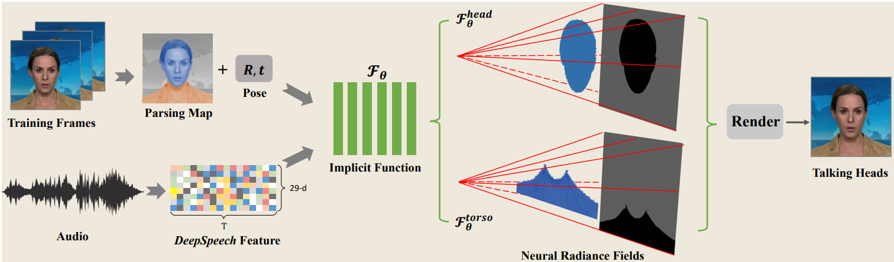

# AD-NeRF: Audio Driven Neural Radiance Fields for Talking Head Synthesis



PyTorch implementation for the paper "[AD-NeRF: Audio Driven Neural Radiance Fields for Talking Head Synthesis (ICCV 2021)](https://arxiv.org/abs/2103.11078)".<br/>
Authors: [Yudong Guo](https://yudongguo.github.io/), [Keyu Chen](http://kychern.github.io/), [Sen Liang](https://scholar.google.com/citations?user=Yv_olnAAAAAJ&hl), [Yong-Jin Liu](https://cg.cs.tsinghua.edu.cn/people/~Yongjin/Yongjin.htm), [Hujun Bao](http://www.cad.zju.edu.cn/home/bao/) and [Juyong Zhang](http://staff.ustc.edu.cn/~juyong/).

## Prerequisites
- You can create an anaconda environment called adnerf with:
    ```
    conda env create -f environment.yml
    conda activate adnerf
    ```
- [PyTorch3D](https://github.com/facebookresearch/pytorch3d)

    Recommend install from a local clone
    ```
    git clone https://github.com/facebookresearch/pytorch3d.git
    cd pytorch3d && pip install -e .
    ```
- [Basel Face Model 2009](https://faces.dmi.unibas.ch/bfm/main.php?nav=1-1-0&id=details) 

    Put "01_MorphableModel.mat" to data_util/face_tracking/3DMM/; cd data_util/face_tracking; run
    ```
    python convert_BFM.py
    ```
## Train AD-NeRF
- Data Preprocess ($id Obama for example)
    ```
    bash process_data.sh Obama
    ```
    - Input: A portrait video at 25fps containing voice audio. (dataset/vids/$id.mp4)
    - Output: folder dataset/$id that contains all files for training

- Train Two NeRFs (Head-NeRF and Torso-NeRF)
    - Train Head-NeRF with command 
        ```
        python NeRFs/HeadNeRF/run_nerf.py --config dataset/$id/HeadNeRF_config.txt
        ```
    - Copy latest trainied model from dataset/$id/logs/$id_head to dataset/$id/logs/$id_com
    - Train Torso-NeRF with command 
        ```
        python NeRFs/TorsoNeRF/run_nerf.py --config dataset/$id/TorsoNeRF_config.txt
        ```
    - You may need the [pretrained models](https://github.com/YudongGuo/AD-NeRF/tree/master/pretrained_models) to avoid bad initialization. [#3](https://github.com/YudongGuo/AD-NeRF/issues/3)
## Run AD-NeRF for rendering
- Reconstruct original video with audio input
    ```
    python NeRFs/TorsoNeRF/run_nerf.py --config dataset/$id/TorsoNeRFTest_config.txt --aud_file=dataset/$id/aud.npy --test_size=300
    ```
- Drive the target person with another audio input
    ```
    python NeRFs/TorsoNeRF/run_nerf.py --config dataset/$id/TorsoNeRFTest_config.txt --aud_file=${deepspeechfile.npy} --test_size=-1
    ```

## Citation

If you find our work useful in your research, please consider citing our paper:

```
@inproceedings{guo2021adnerf,
  title={AD-NeRF: Audio Driven Neural Radiance Fields for Talking Head Synthesis},
  author={Yudong Guo and Keyu Chen and Sen Liang and Yongjin Liu and Hujun Bao and Juyong Zhang},
  booktitle={IEEE/CVF International Conference on Computer Vision (ICCV)},
  year={2021}
}
```

If you have questions, feel free to contact <gyd2011@mail.ustc.edu.cn>.

## Acknowledgments
We use [face-parsing.PyTorch](https://github.com/zllrunning/face-parsing.PyTorch) for parsing head and torso maps, and [DeepSpeech](https://github.com/mozilla/DeepSpeech) for audio feature extraction. The NeRF model is implemented based on [NeRF-pytorch](https://github.com/yenchenlin/nerf-pytorch).
